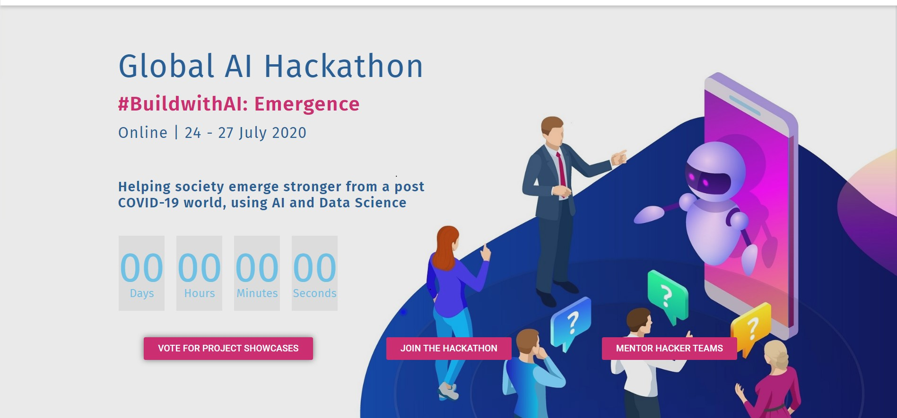

# BuildWithAI | NLP Challenge 	:heart_eyes:

# Team Soothe / Flashpoint :sunglasses: 	:zap:
This repository contains all code files and data we used in the Global AI Hackathon Challenge Competition titled #BuildwithAI : Emergence. In this project, we utilized web scraping techniques to collect data from multi-platforms, leveraged NLP techniques to process the text data, analyzed the data by sentiment analysis and topic modeling, and created a dashboard to present the results. 

## Motivation
There is a lot of going on in the world right now due to the Covid-19 pandemic and we needed to understand and study the public sentiments regarding Covid-19 along with how media and newspapers have impact over it.

## The dataset can be used for 
- To study people's interactions on Twitter during COVID-19 era
- To study public media's behavior during COVID-19 era
- To study people's emotion change during COVID-19 era
- To find the impact of public media on people's emotion during COVID-19 era

## Our data source including:

### Twitter:
* Tweets on Twitter retrieved with [TwitterScraper API ](https://github.com/taspinar/twitterscraper) (daily data from 05/03/20 to 06/07/20)

### News:
* COVID-19 news scraped from [Fox News](https://www.foxnews.com/) (daily data from 01/20 to 04/26)

## Analysis Methods

### Sentiment Analysis

* IBM Tone Analyzer: We used [IBM Watson's](https://www.ibm.com/cloud/watson-tone-analyzer) tone analyzer on our news articles to check the tone with which each article is written when it comes to the most popular topics during the COVID-19 era. The IBM's Tone Analyzer is able to do the sentiment anlysis upto 5 different tones of the text data which is more than neutral-positive-negative sentiment analysis. Through this way, we can study the articles tone more specifically. But there is a limitation that we could not apply this to the tweet dataset since it is slow at a rate of max 3 tweet/sec which would have taken ages for more than 1 million tweets.
* Deep Learning : We created a neural network with LSTM and Stanford Glove embedding on twitter tweets for sentiments ('anger', 'fear', 'joy', 'love', 'sadness', 'surprise). The model's training accuracy was 92% and it took nearly 10 minutes prediction time for tweets on a single day.

